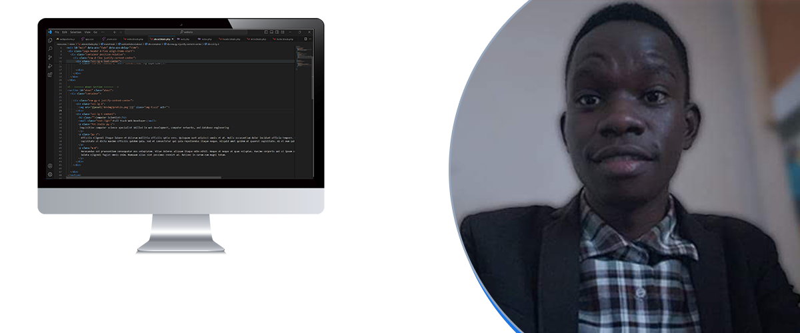
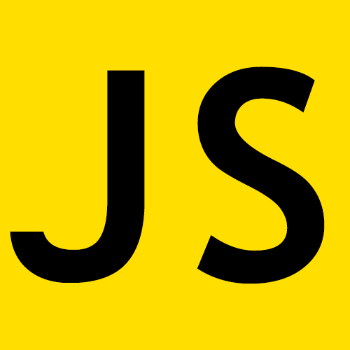
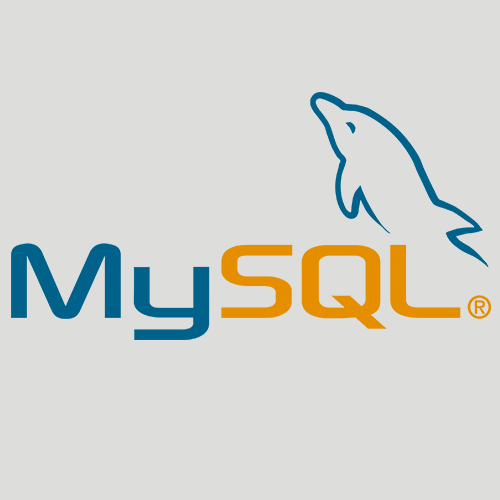
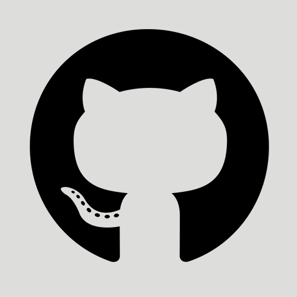
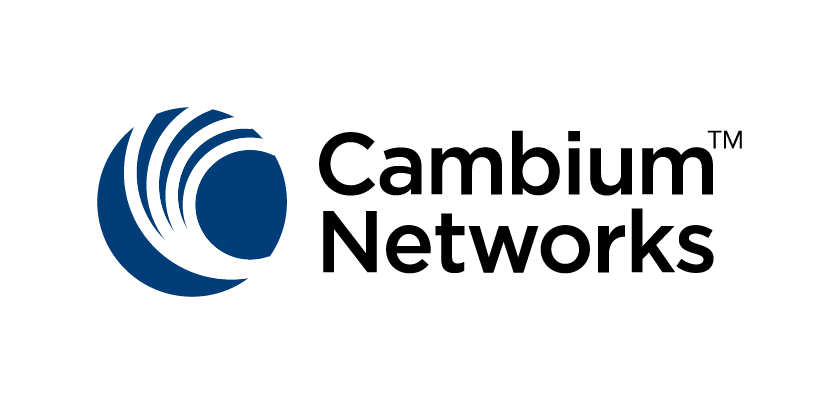

# Hey, I'm Stephen Okello! 👋

```php
# Inquisitive Full-stack Web Developer based in Pallisa, Uganda.
```


### Languages and Tools









<br /><br />



<br /><br />
---

### Projects

- [Laravel Auth](https://github.com/delgont/auth)
- [Schoolviser](https://github.com/schoolviser)
---

